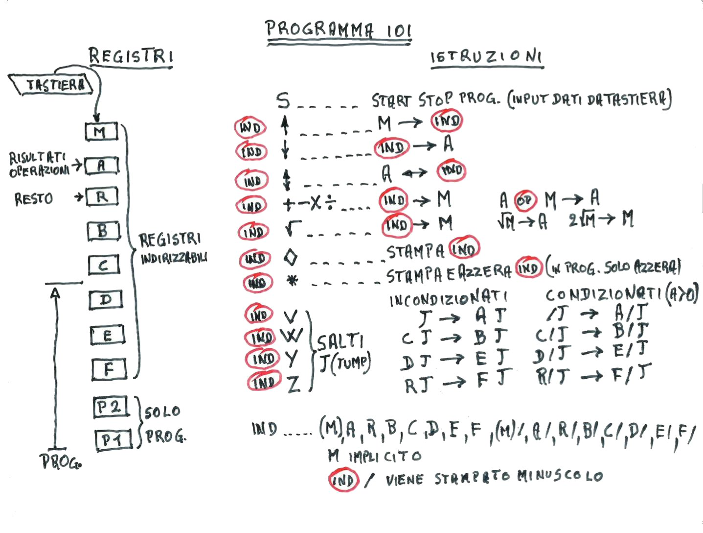
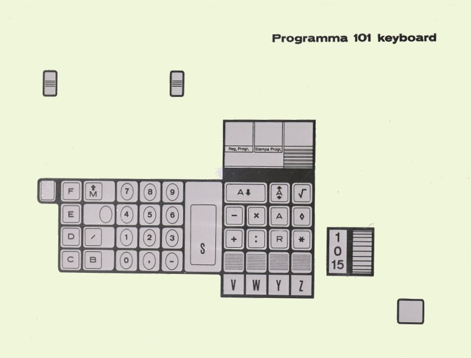

The Olivetti Programma 101 is one of the first programmable calculators,
but don't let the name fool you: the instruction set with jumps and registers
makes it a proper stored-program computer.
The design, form factor, storage and programming capabilities put it
way ahead of its time, and contributed to the well-deserved fame of
**first desktop personal computer**.

This project is a small C interpreter for P101-style programs.
The syntax of the programs uses P101 key-chord notation so listings stay close to the
machine original feel, only a couple of keys were replaced for ease of use on
modern keyboards.



> Instructions by Gastone Garziera.

## Example Program

This program computes N!. The default routine is `V`, but this starts from
`Z`, so run it with `--start Z`.

```p101
A  Z    ; start label
   S    ; stop and wait for user input,
        ; then store it into M
D  <M   ; M -> D
   >A   ; M -> A
A  W    ; loop label
A/ <M   ; generate constant 1 into M
D/ >A
M  -    ; A - M -> A
/  V    ; cond jump
D  #    ; print D
   Z    ; goto start
A/ V    ; cond jump label
D  ><   ; swap A D
D  x    ; A x D -> A
D  ><   ; swap A D
   W    ; goto loop
```

## Program Format

A program is a list of P101 key chords or interpreter directives, one per
line. Comments start with `;`, both on their own line and after an instruction.

Whitespace is only for readability. The examples in this README use spaced
key chords, but compact forms such as `D<M`, `D>`, `D><`, `C/V`, and
`A/<M` are accepted too.

## Keyboard Substitutes

The original keyboard uses a few symbols that are awkward to type in plain
source files. Program files use the ASCII substitutes below.



| Source token | Also accepted | Keyboard role                                |
| ------------ | ------------- | -------------------------------------------- |
| `<M`         | `<`           | transfer from `M`                            |
| `>A`         | `>`           | transfer to `A`                              |
| `><`         | `><A`         | exchange key                                 |
| `#`          |               | print key; with `/`, emits a blank tape line |
| `*`          |               | clear key; in literal mode, digit `9`        |
| `x`          |               | multiply key                                 |
| `:`          |               | divide key                                   |
| `sqrt`       |               | square-root key                              |

## Registers And Context

Registers are `M`, `A`, `R`, `B`, `B/`, `C`, `C/`, `D`, `D/`, `E`, `E/`,
`F`, and `F/`. Lowercase `b` through `f` are accepted as one-letter aliases
for the split registers `B/` through `F/`.

`B` through `F` follow the hardware overlay. Each starts as a 22-digit whole
register. A slash access splits it into two 11-digit halves:
`B/` is the left half and `B` is the right half. Splitting a whole register
that currently holds more than 11 digits is an error.

The clear key controls transitions between the two views. `B/ *` clears the
left half and makes `B` available again as a whole register, keeping the right
half as the current value. `B *` clears the whole register when `B` is unsplit,
or the right half when it is split. The same rule applies to `C`, `D`, `E`,
and `F`. If an instruction-overflow slot occupies one half of `D`, `E`, or
`F`, only the other half can be used for data.

The interpreter enforces the P101 internal program layout: 48 core instruction
slots, then overflow into `F`, `F/`, `E`, `E/`, `D`, and `D/`, for 120
instructions total. Register halves occupied by instructions cannot also be
used as data.

Routine keys are `V`, `W`, `Y`, and `Z`. The same symbol can change meaning
based on the full chord. `D +` uses `D` as a register prefix and adds `D` to
`A`. `D V` is a jump to `E V`, while `A V` defines a reference point. `A ><`
means absolute value, but `/ ><` extracts the decimal part of `A`. After
`A/ <M`, keys such as `S`, `>A`, and `*` are literal digits until the
terminating `D...` or `E...` chord.

## Command Reference

For the forms below, `REG` can be any register listed above. When a register
prefix is optional and omitted, it defaults to `M`; for example, `>A` loads
`M` into `A`.

### Reference Points And Jumps

Let `KEY` be one of `V`, `W`, `Y`, or `Z`. Reference points are labels:
`A KEY`, `A/ KEY`, `B KEY`, `B/ KEY`, `E KEY`, `E/ KEY`, `F KEY`, and
`F/ KEY`. The command-line entry point `--start V` starts at `A V`,
`--start W` starts at `A W`, and so on.

Unconditional jumps are written as `KEY`, `C KEY`, `D KEY`, or `R KEY`;
they target `A KEY`, `B KEY`, `E KEY`, and `F KEY` respectively.

Conditional jumps use the slash forms `/ KEY`, `C/ KEY`, `D/ KEY`, and
`R/ KEY`. They jump only when `A > 0`, targeting `A/ KEY`, `B/ KEY`,
`E/ KEY`, and `F/ KEY` respectively. If `A <= 0`, execution continues with
the next instruction.

### Data Movement And Service Keys

`S` stops and reads the next input value into `M`. With `--input FILE`, it
reads from the file; if there is no more input, the program stops.

`REG <M` copies `M` into `REG`; `REG >A` copies `REG` into `A`; and
`REG ><` exchanges `REG` and `A`. The special form `R ><` copies `R` into
`A` instead of exchanging. `R S` exchanges `D` and `R`.

`REG *` clears a register. `/ ><` copies the decimal part of `A` into `M`.
`A ><` replaces `A` with its absolute value.

### Arithmetic And Output

Arithmetic commands first copy `REG` into `M`. Addition, subtraction, and
multiplication store the exact result in `R` and the rounded result in `A`.
Division stores the quotient in `A` and the remainder in `R`. Square root
stores `sqrt(REG)` in `A`, the remainder `REG - A * A` in `R`, and `2 * A` in
`M`.

The arithmetic forms are `REG +`, `REG -`, `REG x`, `REG :`, and
`REG sqrt`. `REG #` prints a register, while `/ #` prints a blank tape line.

## Literal Constants

Generated constants use the original P101 literal-entry mode. `A/ <M` begins
the sequence. The following key chords are decoded as digits and stored in
`M`; the sequence ends at the first `D...` or `E...` chord.

Digits are entered from least significant to most significant. The terminating
`D` or `E` chord contains the leftmost digit and determines the final sign.

| Digit | Literal key   | Digit | Literal key |
| ----- | ------------- | ----- | ----------- |
| `0`   | `S`           | `5`   | `-`         |
| `1`   | `>A` or `>`   | `6`   | `x`         |
| `2`   | `<M` or `<`   | `7`   | `:`         |
| `3`   | `><A` or `><` | `8`   | `#`         |
| `4`   | `+`           | `9`   | `*`         |

`R` and `R/` continue the literal. `F` and `F/` also continue it, and are
accepted for the original negative-number notation. `D` or `D/` terminates
the sequence as a positive number; `E` or `E/` terminates it as a negative
number. A slash in the prefix marks the decimal point after that digit in the
final number.

Examples:

```p101
; 1
A/ <M
D/ >A
```

```p101
; 12.5
A/ <M
R  -
R/ <M
D  >A
```

```p101
; -12
A/ <M
F  <M
E  >A
```

## Directives

Directives are interpreter conveniences, not P101 keys. Numeric values may
use either `.` or `,` as the decimal separator.

- `.decimals N` or `decimals N`: set decimal precision, from `0` to `15`;
  default is `0`.
- `.set REG VALUE` or `set REG VALUE`: initialize a register before execution.

## CLI Options

- `--start KEY`: select the start routine, one of `V`, `W`, `Y`, or `Z`;
  default is `V`.
- `--input FILE`: read `S` input values from a file.
- `--trace`: print executed instructions to stderr.

## References

- [emulator by Claudio Larini](http://www.claudiolarini.altervista.org/emul2.htm)
- [simulator by Marco Galeotti](http://www.marcogaleotti.com/p101simulator.html)
- [emulator by the University of Amsterdam](https://ub.fnwi.uva.nl/computermuseum/p101emul.html)
